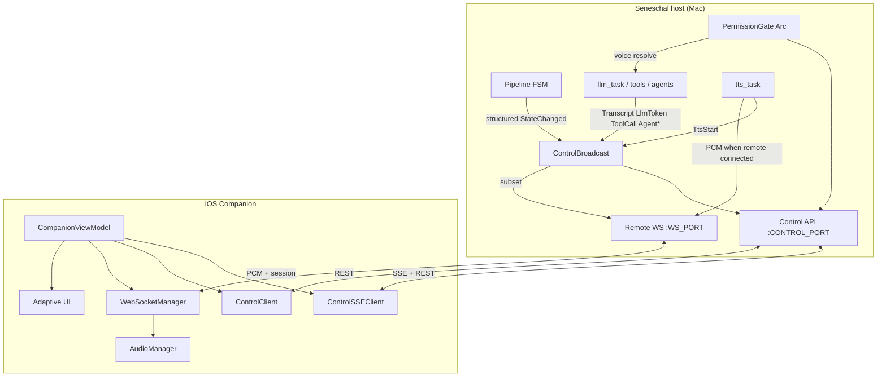
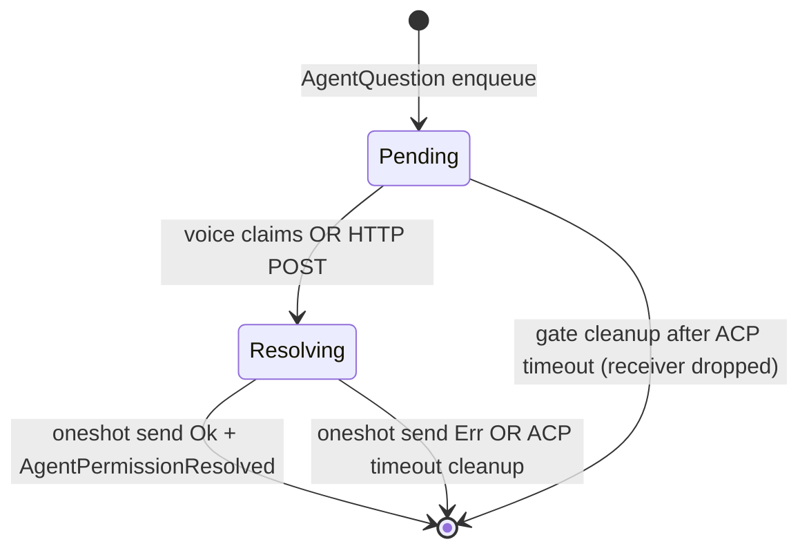
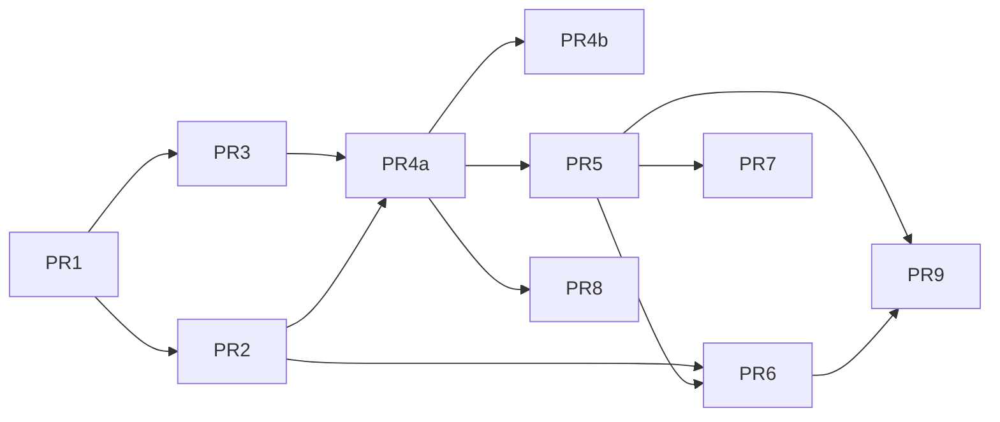

# Design: iOS Companion v2 — TUI Mirror, Control Plane & Adaptive UI

| Field | Value |
|-------|-------|
| **Document** | Issue #190 — iOS companion v2 |
| **Author** | (design agent) |
| **Date** | 2026-08-02 |
| **Status** | Draft (revision 3 — residual review fixes) |
| **Milestone** | v0.1.0-alpha.8 (P0–P2); P3–P5 follow-up under same issue |
| **Scope** | **Option A only** — host remains the brain |
| **Related** | ROADMAP M2.4, `doc/APPLE_WATCH_CLIENT.md`, `tasks/control-ui.md` |

---

## Overview

Seneschal’s iOS companion (`clients/voicebot-ios-companion`) is today a thin remote mic + chat pipe: PCM over WebSocket `/ws`, partial transcript/response text, TTS playback, and a one-shot history fetch. It does not surface pipeline state, tools, system notifications, agent task lifecycle, or permission approvals—surfaces the TUI already has via `TuiEvent` (`crates/seneschal-common/src/tui_events.rs`) and that the Control API partially exposes via `ControlEvent` (`crates/seneschal-control/src/control/broadcast.rs`).

This design turns the companion into a **mobile body of the same host agent**: dual-channel connectivity (WS audio plane + Control HTTP/SSE command/event plane), a ViewModel that mirrors pipeline + timeline semantics, and adaptive iPhone/iPad UI with accessibility. Host remains sole owner of STT→LLM→TTS, memory, tools, and agents. No pure-iOS rebuild, no cloud agent, no WAN/tunnel.

**Alpha.8 target (P0–P2):** ControlEvent parity (structured state + agent/permission **events** + permission **REST endpoint** + tests); iOS Control SSE + StatusBar + mute/input/barge-in; timeline for tools/system/errors. **Follow-up (P3–P5):** agent task rows + PermissionSheet E2E, iPad split/a11y, watchOS light, docs/QA.

**Alpha.8 intentionally ships host permission API without full iOS PermissionSheet** (endpoint is testable via curl/ControlClient; phone UI for approve is P3). See [Alpha.8 acceptance](#alpha8-acceptance-criteria).

---

## Background & Motivation

### Current host surfaces

| Surface | Path | Role today |
|---------|------|------------|
| Remote WS | `crates/seneschal-remote/src/remote/{protocol,server}.rs` | Single remote client; binary PCM; text: `session.start/ready`, `transcript`, `response.text/end`, `audio.start/end`, `barge_in`, `error`. Forwards a **subset** of `ControlEvent` (Transcript, LlmToken, LlmDone, Error) onto WS text frames. |
| Control API | `crates/seneschal-control/src/control/api.rs` | REST + SSE: `/control/events`, `/state`, `/history`, `/sessions`, `/mute`, `/barge_in`, `/input`. Binds `0.0.0.0:CONTROL_PORT` (readme “127.0.0.1 only” is **stale**). |
| ControlEvent | `broadcast.rs` | `StateChanged`, `Transcript`, `LlmToken`, `LlmDone`, `TtsStart`, `ToolCall`, `MuteChanged`, `Error`, `SystemNotification`, `McpNotification`. |
| TuiEvent | `seneschal-common/src/tui_events.rs` | Full UI surface including **agent lifecycle** and **permission requested**; Classification; richer pipeline labels. |
| Pipeline FSM | `seneschal-core/src/pipeline/fsm.rs` | `Idle`, `Listening { id }`, `Thinking { id }`, `Speaking { id }`, `Paused { reason }`. Supervisor currently emits `StateChanged { state: format!("{state:?}"), utterance_id }` — **Debug strings** (e.g. `Listening { utterance_id: 3 }`). This design **replaces** that with structured tokens in P0. |

### Current companion

| Area | State |
|------|--------|
| Models | `RemoteMessage` mirrors remote protocol only (`Models/RemoteMessage.swift`) |
| Transport | `WebSocketManager` — reconnect (5 attempts), 409 → “already connected” UX |
| History | `HistoryClient` → `GET /control/sessions` + `.../messages`; `MessageStore` local JSON cache |
| ViewModel | `CompanionViewModel` — chat bubbles, barge-in via WS, always-on mic stream after `session.ready` |
| UI | `ContentView` + `ConnectionView`/`ConversationView` — title **“Voicebot”**, no status bar of pipeline state, no text composer, no mute, no timeline |
| Defaults | `selectedPort` / `selectedControlPort` both **`"9090"`** — Control should default **`9001`** (see Ports) |
| Watch | `WatchViewModel` + `WatchRelayService` (WCSession relay via iPhone); PTT-ish record/stop; no pipeline state |
| Info.plist | `NSLocalNetworkUsageDescription`, mic, background audio; **no** explicit `NSAllowsLocalNetworking` / ATS arbitrary loads |

### Pain points

1. **Event plane incomplete on Control for agents.** Agent task events are bridged TUI-only in `main.rs` (`#[cfg(feature = "tui")]`) from `SessionEvent`, `ProactiveEvent::AgentQuestion`, **`AgentResult`**, and **`AgentMilestone`**. Control subscribers never see lifecycle or permissions.
2. **Permission answers are voice-FIFO only**, and the string sent back to ACP is treated as **`optionId`** (`run_agent.rs` → `{"outcome":"selected","optionId": …}`). Voice path maps STT to literal `"allow_once"` / `"reject_once"` via `map_answer_to_outcome`, while ACP options use ids like `allow` / `deny` / `always_allow` and store **display labels** (e.g. `"Allow once (allow)"`) in `PendingInteractionEntry.options` — labels are **not** optionIds.
3. **Companion cannot mute, inject text, or show tools** despite host endpoints for mute/input/barge_in and `ToolCall` / `SystemNotification` events.
4. **Dual ports in UX** but Control is used only for history; wrong default Control port.
5. **Branding** still user-facing “Voicebot”.
6. **`POST /control/input` ignores permission FIFO** — can start a concurrent LLM turn while an agent waits for approval.

### Why now

Alpha.8 mobile presence completes remote audio + Control API into one companion without inventing a third protocol or moving the brain on-device.

---

## Goals & Non-Goals

### Goals

1. **Pipeline status bar** driven by Control SSE structured `state_changed` (+ connection health for WS and Control).
2. **Conversation view** with streaming tokens (prefer Control when SSE connected; fall back to WS `response.text`), barge-in, empty/error states.
3. **Event timeline** for tools, system notifications, errors; agent lifecycle rows when events available (rows UI polish in P3).
4. **Controls:** barge-in, mute TTS, text input, disconnect, clear/refresh history.
5. **Agent permission host surface (alpha.8):** structured options + `GET/POST /control/permission*` + SSE `agent_permission_*` + host tests. **iOS PermissionSheet is P3** (follow-up); alpha may show only a minimal non-blocking banner if cheap.
6. **History:** server source of truth on connect; local cache offline.
7. **Adaptive layouts** iPhone + iPad; accessibility (Dynamic Type, VoiceOver, contrast) — iPad/a11y polish in P4.
8. **Graceful degradation** if only WS or only Control is available (including Control-only on WS 409).
9. **Ship safety:** each phase leaves audio path working.

### Non-Goals (explicit)

- WAN / Tailscale / tunnels; cloud-only agent; pure-iOS STT/TTS brain
- Android companion
- Full TUI parity (no prompt-build mode, no classifier force override on mobile)
- Multiplex all events onto WS text frames (Control remains event/command plane)
- Always-listening watchOS claim
- Push notifications / Live Activities / multi concurrent remote **audio** clients
- Opus codec negotiation
- `CONTROL_API_KEY` / bind-address lockdown (follow-on security; tracked in `tasks/control-ui.md` — see Security)

---

## Key Decisions

| # | Decision | Rationale |
|---|----------|-----------|
| K1 | **One brain, multiple bodies** — host owns STT/LLM/TTS/memory/tools/agents | Scope Option A; matches mono-process architecture. |
| K2 | **Prefer Control API for events + commands; extend where TUI-only** | Control already has SSE + mute/input/barge_in/history. |
| K3 | **Dual channel: WS = audio (+ minimal legacy text); Control = SSE + REST** | Control is source of truth for state/tools/agents. No agent multiplex on WS. |
| K4 | **Minimum ControlEvent set for v2** | Structured `state_changed`, tokens/done, tools, system, agent lifecycle, permission requested/resolved, errors (+ mute/tts). Classification is **should-have**. |
| K5 | **Foreground-first dual connection** | SSE + WS while app active; background: stop mic, suspend SSE reconnect, keep optional TTS playback (see Connection state machine). |
| K6 | **P0–P2 = alpha.8; P3–P5 follow-up** | Visible companion without blocking on PermissionSheet / iPad / watch. |
| K7 | **Structured ACP `option_id` contract** | Emit `options: [{id, label, kind}]`; POST `{task_id, option_id}`; voice maps yes/no → first allow-kind / first deny-kind id (like `find_allow_option`). **Never** treat display labels as ACP outcomes. 60s oneshot timeout → `cancelled` (existing `collect_acp_response`). |
| K8 | **Structured pipeline state wire format in P0** | `state`: `idle` \| `listening` \| `thinking` \| `speaking` \| `paused` + optional `pause_reason` + `utterance_id`. Do not ship Debug-string parsing for the companion. No host “Transcribing” FSM state. |
| K9 | **User-facing rename Voicebot → Seneschal** | Brand compliance. |
| K10 | **Single remote audio client (HTTP 409); Control-only observe+text on conflict** | Keep exclusive TTS routing; alpha.8 ships Control-only mode when WS conflicts. |
| K11 | **Host rejects text input while any permission is Pending/Resolving** | `POST /control/input` → 409 + `ControlEvent::Error`; does not answer permission and does not start a concurrent turn. Permission only via `POST /control/permission` or voice path. |
| K12 | **Permission ownership: shared `PermissionGate` (`Arc`) in main; types in `seneschal-common`** | `PermissionOptionWire`, `PermissionPhase`, and gate/slot types live in **`seneschal-common`** (shared by extras + control without cross-deps). Main always constructs `Arc<PermissionGate>`; under `feature = "control"`, clone into `ControlState`. Gate works with control **off** (voice path). Explicit Pending → Resolving → Resolved \| TimedOut; oneshot send-failure cleans slot. |
| K13 | **SSE: remove cumulative byte cap** | Keep lag → `Error { missed N }` + client resync via `/control/state`. Optional per-event size guard only. |
| K14 | **iOS default Control port = 9001** | Align with docs (`CONTROL_PORT=9001`); WS remains 9090. |

---

## Proposed Design

### Architecture



### Connection orchestration

```mermaid
sequenceDiagram
  participant UI as Companion UI
  participant VM as ViewModel
  participant REST as Control REST
  participant SSE as Control SSE
  participant WS as Remote WS
  participant H as Host

  UI->>VM: Connect(host, wsPort=9090, controlPort=9001)
  Note over VM: single-flight connect (ignore double-tap)
  VM->>REST: GET /control/health
  alt Control healthy
    VM->>SSE: GET /control/events
    VM->>REST: GET /control/state
    VM->>REST: GET /control/sessions + messages
  else Control down
    VM->>VM: controlLink=failed; continue WS-only degrade
  end
  VM->>WS: connect /ws + session.start
  alt 409 Conflict
    WS-->>VM: audioLink=conflict
    Note over VM: Control-only mode: observe + text + mute; no mic
  else session.ready
    WS-->>VM: audioLink=connected
    VM->>VM: start mic only if foreground
  end
  H-->>SSE: state_changed / llm_token / tool_call / ...
  H-->>WS: audio binary + optional response.text
  UI->>VM: mute / input / barge_in
  VM->>REST: POST /control/*
```

### Connection state machine (iOS)

**Link enums**

```swift
enum LinkState: Equatable {
    case disconnected
    case connecting
    case connected
    case reconnecting(attempt: Int)
    case failed(String)
    case conflict          // WS only: HTTP 409 another remote client
}
```

**Policies**

| Channel | Connect | Reconnect | Cap |
|---------|---------|-----------|-----|
| Control SSE | After health OK | Exponential 1s → 2 → 4 → … → **30s** cap; infinite while user wants session | None (until Disconnect) |
| Control REST | Per-call | No auto-reconnect | N/A |
| Remote WS | After Control attempt (or parallel); `session.start` | Existing **5 attempts**, base delay × attempt (keep `WebSocketManager`) | Stop after 5; user taps Connect again |
| Mic capture | Only after `session.ready` **and** `scenePhase == .active` | N/A | Stop on background / disconnect / conflict |

**Events × actions (abbreviated)**

| Event | audioLink | controlLink | Actions |
|-------|-----------|-------------|---------|
| User Connect | → connecting | → connecting | Cancel any prior connect tasks; health → SSE → state/history → WS |
| Health fail | (unchanged / proceed) | → failed | Banner “Control unavailable”; continue WS-only if desired |
| SSE open | — | → connected | GET state; clear lag banner |
| SSE lag Error | — | stay connected | Banner; GET `/control/state`; do not tear WS |
| SSE die mid-session | — | → reconnecting(n) | Backoff reconnect SSE only |
| WS session.ready | → connected | — | Start mic if foreground; `preferControlTokens = controlLink==connected` |
| WS 409 | → conflict | (keep) | **Control-only mode**: mute/input/history/status; no mic; branded copy |
| WS fail (other) | → failed / reconnecting | — | Existing 5-attempt policy |
| User Disconnect | → disconnected | → disconnected | Cancel tasks; stop mic; close SSE+WS |
| scenePhase background | stay / stop mic | stay / pause SSE reconnect | **Stop mic capture**; cancel SSE reconnect timer; **keep** WS if possible for TTS; **playback may continue** (`UIBackgroundModes=audio`) |
| scenePhase active (was connected) | restore mic if was connected | resume SSE if needed | Restart mic if `audioLink==connected`; resume SSE |

**Single-flight:** `connect()` sets a generation token / cancels previous `Task`; Connect button disabled while either link is `connecting`.

**Token de-dupe rules**

| Condition | Source of truth for assistant stream |
|-----------|--------------------------------------|
| `controlLink == .connected` and received ≥1 `llm_token` for current `utterance_id` | Control only; **ignore** WS `response.text` until `llm_done` or new utterance |
| Control connected but no tokens yet for utterance (slow SSE) | Buffer WS tokens ≤500ms; if Control token arrives, drop WS buffer for that utterance; if not, commit WS |
| Control down / lag after stream started | Finish current stream from whichever channel last produced; next turn re-evaluate |
| `llm_done` on Control | Finalize assistant bubble; ignore subsequent WS `response.end` for same utterance |
| `response.end` on WS only | Finalize if Control never claimed the utterance |

Track `activeUtteranceId: UInt64?` and `tokenSource: enum { none, control, ws }`.

### Degradation matrix

| WS | Control | Behavior |
|----|---------|----------|
| ✓ | ✓ | Full companion (alpha target) |
| ✓ | ✗ | Audio + chat from WS text; no live state/tools/mute/input; history offline/local |
| ✗ / conflict | ✓ | **Control-only:** text input, mute, history, status, timeline; no remote mic/TTS |
| ✗ | ✗ | Offline: local history only |

### Workstream mapping

| WS | Focus |
|----|--------|
| **W1 Host event parity** | Structured state; ControlEvent agents/permission; PermissionGate; emit sites; ClientControlEvent; SSE longevity; tests/docs |
| **W2 iOS networking** | SSE client, REST helpers, orchestration, Codable models, default ports |
| **W3 Domain + ViewModel** | PipelineState, TimelineItem, CompanionViewModel, connection SM |
| **W4 UI adaptive** | StatusBar, Conversation, Timeline, Composer, PermissionSheet (P3), iPad split (P4) |
| **W5 Controls & session UX** | Mute, input, disconnect, history, conflict UX, reconnect |
| **W6 watchOS light** | Pipeline state + PTT + last line via WCSession |
| **W7 Docs/QA/roadmap** | Apple client docs, naming, ROADMAP M2.4 |

---

## Host: ControlEvent parity (W1 / P0)

### Gap analysis (audit)

| Event class | TuiEvent / site | ControlEvent today | Emitted to Control? | ClientControlEvent? |
|-------------|-----------------|--------------------|---------------------|---------------------|
| State | FSM supervisor `main.rs` | `StateChanged` (Debug string) | Yes — **needs structured** | Yes |
| Transcript | `llm_task` | `Transcript` | Yes | Yes |
| Tokens / done | `llm_task` | `LlmToken` / `LlmDone` | Yes | Yes |
| TTS start | `tts_task` | `TtsStart` | Yes | Yes |
| Tool | `llm_task` | `ToolCall` | Yes | Yes |
| System | `llm_task` | `SystemNotification` | Yes | **No** |
| MCP | `main.rs` McpNotification | `McpNotification` | Yes | **No** |
| Mute | API | `MuteChanged` | Yes | Yes |
| Error | various | `Error` | Partial | Yes |
| Classification | TUI from llm_task | — | No | No |
| Agent session bridge | `main.rs` ~1062–1169 `SessionEvent` → AgentTask* | — | **TUI only** | No |
| Agent completed | `ProactiveEvent::AgentResult` ~1517 → `AgentTaskCompleted` | — | **TUI only** | No |
| Agent milestones | `ProactiveEvent::AgentMilestone` ~1664 — ES/EN **substring heuristics** → Running/Finalizing/Delegated | — | **TUI only** | No |
| Permission | `AgentQuestion` ~1572 → TUI PermissionRequested | — | **TUI only** | No |

### Structured `StateChanged` (P0 wire break for Control consumers)

Replace Debug formatting in the FSM supervisor (`main.rs`):

```rust
// ControlEvent::StateChanged
StateChanged {
    state: String,                 // "idle" | "listening" | "thinking" | "speaking" | "paused"
    utterance_id: Option<u64>,
    #[serde(skip_serializing_if = "Option::is_none")]
    pause_reason: Option<String>,  // "consolidation" when paused
}
```

Mapper:

| FSM | `state` | `pause_reason` |
|-----|---------|----------------|
| `Idle` | `idle` | — |
| `Listening {..}` | `listening` | — |
| `Thinking {..}` | `thinking` | — |
| `Speaking {..}` | `speaking` | — |
| `Paused { Consolidation }` | `paused` | `consolidation` |

Also update `GET /control/state` JSON to use the same tokens (today `format!("{ps:?}")`).

**Compat:** Companion is greenfield for StatusBar SSE. Rust `ClientControlEvent` and examples update in PR1. No requirement to parse old Debug strings on iOS.

**Not inventing Transcribing:** TUI’s `PipelineState::Transcribing` remains TUI-only; companion maps host tokens only.

### Proposed `ControlEvent` extensions

In `crates/seneschal-control/src/control/broadcast.rs` (serde `tag = "type", rename_all = "snake_case"`):

```rust
// StateChanged fields updated as above (structured state string).

Classification {
    intent: String,           // "simple" | "complex"
    level: String,            // heuristic | embedding | logistic | fallback
    forced: bool,
    utterance_id: Option<u64>,
},

AgentTaskStarted {
    task_id: String,
    agent_name: String,
    objective: String,        // may be empty at Started — see emit-site notes
},
AgentTaskRunning {
    task_id: String,
    objective: String,
},
AgentTaskDelegated {
    task_id: String,
    objective: String,
},
AgentTaskFinalizing {
    task_id: String,
    objective: String,
},
AgentTaskCompleted {
    task_id: String,
    objective: String,
    result: String,           // truncated per policy
},
AgentTaskFailed {
    task_id: String,
    message: String,
},
AgentPermissionRequested {
    task_id: String,
    agent_name: String,
    description: String,
    options: Vec<PermissionOptionWire>,
},
AgentPermissionResolved {
    task_id: String,
    option_id: String,        // ACP optionId, or "cancelled"
},
```

```rust
// Defined in seneschal-common (e.g. events.rs or permission.rs) — NOT only in control/extras.
// ControlEvent / ClientControlEvent re-use the same type via seneschal_common.
#[derive(Debug, Clone, Serialize, Deserialize)]
pub struct PermissionOptionWire {
    pub id: String,              // ACP optionId, e.g. "allow", "deny", "always_allow"
    pub label: String,           // UI string, e.g. "Allow once"
    #[serde(skip_serializing_if = "Option::is_none")]
    pub kind: Option<String>,    // "allow" | "reject" | … when present on ACP option
}
```

**Wire type tags:** `state_changed`, `agent_task_started`, `agent_permission_requested`, `agent_permission_resolved`, etc.

Mirror into:

- `ClientControlEvent` (+ `SystemNotification`, `McpNotification`, all agent/permission variants)
- iOS `ControlEvent` Codable enum
- Control crate may `pub use seneschal_common::…::PermissionOptionWire` for handler convenience

**Unknown variants (Rust client):** tagged enums cannot skip unknowns without a catch-all. PR1 adds **all known** variants and updates exhaustive matches in examples. Optional: `#[serde(other)] Unknown` only if a catch-all variant is introduced — not required for alpha if client stays lockstep with `ControlEvent`. Document: **test/Control clients must ship with host**.

**iOS:** unknown `type` → log + skip (decode with flexible strategy / default case).

### Emit sites (host) — complete table

Every path that today does `tui_tx.send(AgentTask*)` or permission must twin to Control under `feature = "control"` (independent of `tui`).

| Site | Source | TUI today | Control emit |
|------|--------|-----------|--------------|
| Session bridge | `SessionEvent::Status::Started` | `AgentTaskStarted` (objective often **empty**) | Same; objective may be `""` until Running/Result |
| Session bridge | `Busy` | `AgentTaskRunning` | Same |
| Session bridge | `Done` | `AgentTaskFinalizing` (**not** Completed) | Same mapping — do not invent Completed here |
| Session bridge | `Error` | `AgentTaskFailed` | Same |
| Session bridge | ToolCall / ToolResult / AgentMessage | `AgentTaskRunning` (objective = progress text) | Same |
| `ProactiveEvent::AgentResult` | ~1517 | `AgentTaskCompleted { task_id, objective: task, result }` | **Must twin** — this is the real Completed path |
| `ProactiveEvent::AgentMilestone` | ~1664 | Heuristic ES/EN substrings → Running / Finalizing / Delegated | **Must twin**; document heuristic as **known quality debt** — do not block alpha on objective propagation rewrite |
| `ProactiveEvent::AgentQuestion` | ~1572 | `AgentTaskPermissionRequested` | `AgentPermissionRequested` with structured options |
| Voice or HTTP resolve | FIFO / gate | (none today) | `AgentPermissionResolved` |
| Classification | llm_task → TUI | `Classification` | should-have Control twin |

Helper pattern:

```rust
fn emit_agent_ui(
    tui: &Option<TuiEventTx>,
    #[cfg(feature = "control")] ctrl: &ControlBroadcast,
    tui_ev: TuiEvent,
    #[cfg(feature = "control")] ctrl_ev: ControlEvent,
) { … }
```

**Objective quality:** Started empty is acceptable for alpha timeline (“Agent started”). Prefer Completed from `AgentResult`. Milestone heuristics remain until a later cleanup issue; companion shows `objective` text as-is.

### Permission contract (ACP optionId)

#### Problem (verified)

- `collect_acp_response` builds display strings: `"{label} ({optionId})"` into `ProactiveEvent::AgentQuestion.options` / `PendingInteractionEntry.options`.
- User/voice answer is sent as ACP **`optionId`**: `{"outcome":"selected","optionId": outcome_option_id}`.
- Voice maps to `"allow_once"` / `"reject_once"` — **not** the agent’s `allow` / `deny` ids.
- 60s timeout → empty string → `{"outcome":"cancelled"}`.

#### Wire contract (v2)

**On request (ControlEvent + GET):**

```json
{
  "type": "agent_permission_requested",
  "task_id": "task-abc",
  "agent_name": "hermes",
  "description": "bash: rm -rf /tmp/x",
  "options": [
    {"id": "allow", "label": "Allow once", "kind": "allow"},
    {"id": "deny", "label": "Deny", "kind": "reject"},
    {"id": "always_allow", "label": "Always allow", "kind": "allow"}
  ]
}
```

**On resolve (ControlEvent):**

```json
{
  "type": "agent_permission_resolved",
  "task_id": "task-abc",
  "option_id": "allow"
}
```

**POST body:**

```json
{ "task_id": "task-abc", "option_id": "allow" }
```

**Host validation:** `option_id` must be one of the pending entry’s option ids, or special `cancelled`. **Do not** accept display labels.

#### Data model changes in host

When handling ACP `session/request_permission` in `run_agent.rs`, preserve structured options (not only label strings):

```rust
// ProactiveEvent (seneschal-common/events.rs) and PendingInteractionEntry:
options: Vec<PermissionOptionWire>,  // id, label, kind — type also in seneschal-common
```

TUI can keep showing `label` (or `format!("{label} ({id})")` as today for display only).

#### Voice path mapping (fix)

Replace bare `allow_once` / `reject_once` with:

```text
yes-like STT → first option where kind=="allow" OR id in {"allow","always_allow","allow_once"}
             → else first option (find_allow_option style)
no-like  STT → first option where kind=="reject" OR id in {"deny","reject","reject_once"}
             → else "cancelled" if no deny option
```

Emit `AgentPermissionResolved` after successful oneshot send on both voice and HTTP (see cleanup rule below for send failure / ACP timeout).

### PermissionGate ownership & state machine

**Crate home (required by dep graph):**

| Type | Crate | Why |
|------|-------|-----|
| `PermissionOptionWire` | **`seneschal-common`** | Used by `ProactiveEvent::AgentQuestion`, ControlEvent, extras, control — common is the only shared base (`control` ↛ `extras`, `extras` ↛ `control`) |
| `PermissionPhase`, `PermissionSlot` shapes used on the bus | **`seneschal-common`** | Same sharing story; serde-friendly if exposed on GET |
| `PermissionGate` (queue + methods) | **`seneschal-common`** (preferred) or thin wrapper in extras | Must work with `feature = "control"` **off** (voice path / PR2 test #5). Main always builds `Arc<PermissionGate>`. |
| Control API handlers | `seneschal-control` | Holds `Arc<PermissionGate>` on `ControlState` only under `feature = "control"` (clone from main) |

Do **not** define `PermissionOptionWire` only in control or extras (forces circular or duplicated types).

**Chosen model:** Main constructs `Arc<PermissionGate>` unconditionally. Under `feature = "control"`, clone into `ControlState`. Control may `pub use` common types for handlers.

```rust
// seneschal-common — conceptual
pub struct PermissionGate {
    inner: Mutex<VecDeque<PermissionSlot>>,
}

pub struct PermissionSlot {
    pub task_id: String,
    pub agent_name: String,
    pub description: String,
    pub options: Vec<PermissionOptionWire>,
    pub response_tx: Option<oneshot::Sender<String>>, // taken when Resolving claims send
    pub phase: PermissionPhase,
}

pub enum PermissionPhase {
    Pending,
    Resolving,   // voice STT in flight OR HTTP accepted; oneshot not yet completed
    // terminal: slot removed after Resolved / cancelled cleanup
}
```

**Transitions**



**ACP timeout vs gate cleanup (explicit rule):**

Verified: `collect_acp_response` waits 60s on `resp_rx`, then sends ACP `{"outcome":"cancelled"}` and **drops the receiver**. It **never** calls the gate. Cleanup is **send-side / gate-side only**, not inside the ACP collector.

| Situation | Gate action | ControlEvent | HTTP if POST |
|-----------|-------------|--------------|--------------|
| Voice/HTTP `response_tx.send(option_id)` **Ok** | Remove slot under lock | `AgentPermissionResolved { option_id }` | 204 (if HTTP was claimer) |
| `response_tx.send` **Err** (receiver dropped — ACP 60s timeout or collector cancelled) | Remove slot under lock | Emit `AgentPermissionResolved { option_id: "cancelled" }` **if not already emitted for this task_id** | **409** (or **410** Gone — prefer **409** for consistency with race table) if client still tries POST |
| POST after slot already removed | No-op | — | **409** (already resolved/cancelled) or **404** if never known — prefer **409** when task_id was seen this session optional; **404** if unknown is fine |
| Voice STT completes after timeout cleaned slot | No-op (log) | — | — |

Helper on gate (conceptual):

```rust
impl PermissionGate {
    /// Take sender, try send, always remove slot; returns whether ACP side still listening.
    pub fn resolve(&self, task_id: &str, option_id: &str) -> ResolveOutcome { … }
    // ResolveOutcome: Sent | AlreadyGone | UnknownTask
}
```

Idempotent: double resolve for same `task_id` → second call `AlreadyGone` (HTTP 409). Optional: track recent cancelled ids briefly if product wants 409 vs 404 distinction; alpha may use 404 for missing and 409 only while `Resolving`.

**HTTP**

| Code | Meaning |
|------|---------|
| 204 | Success: slot claimed, oneshot sent with `option_id`, event emitted |
| 404 | Unknown `task_id` / not in gate |
| 409 | Already Resolving (other claimer), already resolved, or oneshot closed (timeout/cancelled) |
| 400 | `option_id` not in options list |

**Voice path change (behavior-preserving intent):**

1. Under lock: if front is `Pending`, set `Resolving` (do **not** drop slot until resolve attempt).
2. Async STT → map to option_id → `gate.resolve(task_id, option_id)` (send + remove + emit).
3. If HTTP already claimed / timeout cleaned → voice no-ops (log).
4. On send failure after timeout: gate still removes slot and emits cancelled Resolved so GET list is empty.

**GET `/control/permissions`:** list slots in `Pending` (and optionally `Resolving` with `phase` field for UI disable). Never lists timed-out slots after cleanup.

### Text input vs permission (host guard)

In `post_input` (`api.rs`):

```text
if permission_gate.has_pending_or_resolving() {
    broadcast Error { "permission pending — use POST /control/permission" }
    return 409 CONFLICT  // or 503; pick 409 for "wrong state"
}
// else existing TextInput path
```

iOS Composer: disable send when `pendingPermission != nil` **in addition** to host guard (defense in depth). Voice path remains the intentional alternate resolver.

### Truncation policy

| Field | Max on wire | Client display |
|-------|-------------|----------------|
| `ToolCall.result` | 16 KiB then `"…[truncated]"` | Expand first 2k |
| `AgentTaskCompleted.result` | 32 KiB | Expand sheet in P3+ |

### SSE longevity fix (P0) — chosen policy

**Remove** `MAX_SSE_BUFFER_SIZE` cumulative close entirely.

Retain:

- Broadcast channel capacity **256**; on lag → emit `Error { "Missed {n} events (subscriber lagged)" }` and continue.
- `KeepAlive::default()` on axum SSE.
- Client: on lag Error → `GET /control/state` (+ history if needed); no event replay in alpha.

Optional later: per-event max serialize size (drop/truncate giant tool results at emit site — already covered by truncation policy).

**Regression test:** push >1 MiB of synthetic events through SSE handler; stream must remain open.

### Wire fixtures (for PR1 serde + PR3 iOS tests)

**StateChanged**

```json
{"type":"state_changed","state":"thinking","utterance_id":42}
```

```json
{"type":"state_changed","state":"paused","utterance_id":null,"pause_reason":"consolidation"}
```

**AgentPermissionRequested**

```json
{
  "type":"agent_permission_requested",
  "task_id":"t1",
  "agent_name":"hermes",
  "description":"bash: ls",
  "options":[{"id":"allow","label":"Allow once","kind":"allow"},{"id":"deny","label":"Deny","kind":"reject"}]
}
```

**AgentPermissionResolved**

```json
{"type":"agent_permission_resolved","task_id":"t1","option_id":"allow"}
```

**AgentTaskCompleted**

```json
{"type":"agent_task_completed","task_id":"t1","objective":"list files","result":"ok\n"}
```

**GET `/control/permissions`**

```json
[{
  "task_id":"t1",
  "agent_name":"hermes",
  "description":"bash: ls",
  "options":[{"id":"allow","label":"Allow once","kind":"allow"}],
  "phase":"pending"
}]
```

**POST `/control/permission`**

```json
{"task_id":"t1","option_id":"allow"}
```

### Tests (host)

- Serde round-trip all new variants + structured state
- SSE stays open past 1 MiB equivalent
- Permission: HTTP 204 resolves oneshot with correct option_id
- Permission: HTTP 409 when Resolving; 404 unknown; 400 bad option_id
- Permission: voice-only still works with `control` feature on (no behavior regression for STT path)
- Permission: voice vs HTTP race — first wins, second 409 / no-op
- `POST /control/input` returns 409 while permission pending
- Emit: AgentResult → AgentTaskCompleted on Control broadcast (unit/integration with mock subscriber)

### Docs

- `doc/ARCHITECTURE.md` ControlEvent list + structured state
- `readme.md` CONTROL bind `0.0.0.0`; recommend `WS_PORT=9090` + `CONTROL_PORT=9001`
- Companion / Apple client dual-channel guide

---

## iOS: Networking (W2 / P1)

### New types

`Models/ControlEvent.swift` — Codable; fixtures above.

`Models/PipelineState.swift`:

```swift
enum CompanionPipelineState: String, Equatable {
    case idle, listening, thinking, speaking, paused, unknown
    // Map host state field 1:1; no Debug parsing
}
struct PermissionOption: Codable, Identifiable {
    var id: String
    var label: String
    var kind: String?
}
```

### Services

| Service | Responsibility |
|---------|----------------|
| `ControlSSEClient` | SSE parse; reconnect 1s→30s; yields `AsyncStream<ControlEvent>` |
| `ControlClient` | health, state, history, sessions, mute, barge_in, input, permissions |
| ViewModel connection SM | See state machine table |

### Ports

| Field | Default | Label |
|-------|---------|-------|
| WS | **9090** | “WebSocket port” |
| Control | **9001** | “Control port” |

Change `DiscoveryManager.selectedControlPort` and `ConnectionView` defaults from `"9090"` → **`"9001"`**.

On connect: if WS succeeds and Control health fails, banner: “Check Control port (often 9001) — WS is up.” Optional: one-shot probe of alternate common ports is **not** required for alpha.

### ATS / cleartext

Do **not** assume ATS exceptions already exist. Current project has local-network usage description only.

1. Device QA: cleartext `http://` Control + `ws://` on LAN.
2. If fails: add minimal `NSAppTransportSecurity` / local networking exception.
3. Rename any “Voicebot” local-network usage string → Seneschal with branding pass.

### Barge-in / mute / input / permission

| Action | Primary | Fallback |
|--------|---------|----------|
| Barge-in | `POST /control/barge_in` | WS `barge_in` |
| Mute | `POST /control/mute` | N/A |
| Text input | `POST /control/input` | N/A; disabled if permission pending |
| Permission | `POST /control/permission` `{task_id, option_id}` | Voice STT on host |

---

## Domain model & ViewModel (W3 / P1–P2)

### Timeline vs conversation

```swift
enum TimelineKind {
    case user, assistant, tool, system, agentTask, error, mcp
}

struct TimelineItem: Identifiable {
    let id: String
    var kind: TimelineKind
    var text: String
    var timestamp: Date
    var agent: AgentTaskInfo?
    var toolName: String?
    var isStreaming: Bool
}
```

Conversation pane: user + assistant. Timeline: tools, system, agent, errors.

### CompanionViewModel state

```swift
@Published var audioLink: LinkState
@Published var controlLink: LinkState
@Published var pipelineState: CompanionPipelineState
@Published var ttsMuted: Bool
@Published var timeline: [TimelineItem]
@Published var streamingAssistant: String
@Published var pendingPermission: PermissionRequest?  // for P3 sheet; alpha optional banner
@Published var errorBanner: String?
@Published var classificationChip: String?
```

Mic: only `audioLink == .connected` && foreground. Token rules: see Connection state machine.

### History

1. Local `MessageStore` immediately  
2. Server active session replaces conversation  
3. Timeline ephemeral from SSE only (no tool history schema in alpha)

---

## UI adaptive (W4 / P2–P4)

| Component | Role | Phase |
|-----------|------|-------|
| `StatusBarView` | Pipeline chip + dual link dots + mute | P1 |
| `ConversationView` | Bubbles, streaming, empty/error | P1–P2 |
| `TimelineView` | Tool/system/error (+ agent in P3) | P2 |
| `ComposerView` | Text + send + barge-in; disable on pending permission | P1 |
| `PermissionSheet` | option_id buttons | **P3** |
| Minimal permission banner | Optional non-blocking “Agent needs approval — use voice or wait for P3 UI” | alpha optional |
| `ConnectionView` | Host + WS 9090 + Control **9001** labels | P1 |
| iPad split / a11y | Size classes, Dynamic Type, VoiceOver | P4 |

Layouts unchanged from prior revision (iPhone stack / iPad split).

### Naming

Replace user-visible “Voicebot” → **“Seneschal”** (title, 409 copy, local network strings).

---

## watchOS light (W6 / P5)

iPhone relay only; WCSession messages for `pipeline_state` and `last_line`; PTT unchanged; no always-listening.

---

## API / Interface Changes

### Host Control API

| Method | Path | Body / response | Notes |
|--------|------|-----------------|-------|
| GET | `/control/events` | SSE JSON | No byte cap; lag Error |
| GET | `/control/state` | `{state, utterance_id, pause_reason?, tts_muted}` | Structured state |
| GET | `/control/permissions` | `[{task_id, agent_name, description, options, phase}]` | New |
| POST | `/control/permission` | `{task_id, option_id}` → 204/400/404/409 | New |
| POST | `/control/input` | `{text}` | **409 if permission pending** |
| existing | mute, barge_in, history, sessions | unchanged semantics | |

### Remote WS

No required protocol change for alpha.

### iOS modules

```
Models/ControlEvent.swift
Models/TimelineItem.swift
Models/PipelineState.swift
Services/ControlClient.swift
Services/ControlSSEClient.swift
ViewModels/CompanionViewModel.swift
Views/StatusBarView.swift
Views/TimelineView.swift
Views/ComposerView.swift
Views/PermissionSheet.swift   // P3
Views/ConversationView.swift
```

---

## Data Model Changes

- **Host SQLite:** none.
- **Host shared types (`seneschal-common`):** `PermissionOptionWire`, `PermissionPhase`, `PermissionGate` / slot; `ProactiveEvent::AgentQuestion.options` becomes `Vec<PermissionOptionWire>`.
- **Host in-memory:** main-owned `Arc<PermissionGate>`; cloned into `ControlState` only with `feature = "control"`.
- **iOS local:** `StoredMessage` unchanged.
- **Migration:** additive events; structured `state` is a Control wire cleanup in P0 (update Rust client + examples same PR).

---

## Alternatives Considered

### A. Multiplex all events on Remote WS text frames

**Rejected** — mixes audio reliability with chatty events; Control unused (K3).

### B. Pure Control-only companion (on-device STT)

**Rejected** — violates Option A.

### C. Control WebSocket bidirectional instead of SSE + REST

**Deferred** — more host work; SSE+REST sufficient for alpha.

### D. Separate PermissionBroker crate

**Rejected** — `PermissionGate` Arc is enough for mono-user FIFO.

### E. Status-only alpha (structured StateChanged only; no agent events on Control)

**Pros:** Faster StatusBar; smaller P0.  
**Cons:** Unblocks P3 only after a second host freeze; agent emit sites already identified; permission HTTP needs structured options anyway.  
**Rejected for host P0:** ship agent lifecycle + permission events with structured state in one host pass so P3 is client-only.

### F. Forward agent events on WS for Control-less hosts

**Pros:** Thin audio-only clients see tools.  
**Cons:** Protocol churn; dual maintenance; Control is the intended plane.  
**Rejected** for v2 (WS keeps transcript/token subset only).

---

## Security & Privacy Considerations

| Topic | Assessment | Mitigation |
|-------|------------|------------|
| Control binds `0.0.0.0` | LAN exposure | Trusted LAN model; future `CONTROL_API_KEY`; optional bind env |
| **Permission POST on open LAN** | **Higher impact than history GET** — any LAN peer can approve agent tool calls | Document explicitly; same physical-trust as host; key auth follow-on issue from `tasks/control-ui.md` |
| Cleartext HTTP/WS | No credentials | LAN-only; device QA for ATS |
| Mic | Streams to host | Stop on background |
| History on device | Local JSON | Clear action |

Threat model: **trusted LAN, single user**.

---

## Observability

- Host: `control`, `remote`, `acp`, `fsm`; log permission enqueue/resolve with task_id + option_id + phase.
- iOS: Logger for Control connect/lag/reconnect; skip unknown events.
- Battery: dual sockets + mic **foreground only**.

---

## Rollout Plan

| Phase | Milestone | Deliverable | Ship gate |
|-------|-----------|-------------|-----------|
| **P0** | alpha.8 | Structured state; ControlEvent agents/permission; PermissionGate + REST; SSE no byte cap; emit-site twins; tests | `cargo test` / clippy; voice permission still works |
| **P1** | alpha.8 | iOS Control SSE + StatusBar + mute/input/barge-in + ports 9090/9001 + naming + Control-only on 409 | Audio works if Control down |
| **P2** | alpha.8 | Timeline tools/system/errors + conversation polish | Mic not broken |
| **P3** | follow-up | Agent rows + PermissionSheet (`option_id`) E2E | HTTP + voice resolve |
| **P4** | follow-up | iPad + a11y | Size classes |
| **P5** | follow-up | watchOS + docs/QA | No always-listen claims |

### Alpha.8 acceptance criteria

**Host (P0)**

- [ ] `state_changed.state` ∈ {idle, listening, thinking, speaking, paused}
- [ ] SSE remains open after >1 MiB of events
- [ ] `GET/POST /control/permission*` with structured options; voice path maps to real optionIds
- [ ] `agent_permission_requested` / `resolved` and agent task events appear on SSE
- [ ] `POST /control/input` → 409 while permission pending
- [ ] Voice-only permission still works with control feature enabled

**iOS (P1–P2)**

- [ ] Default Control port 9001; WS 9090
- [ ] StatusBar shows Thinking when host emits `state_changed` thinking
- [ ] Mute toggles TTS via Control; barge-in works (Control or WS fallback)
- [ ] Text input injects a turn when no permission pending
- [ ] Timeline shows ToolCall / SystemNotification / Error from SSE
- [ ] WS 409 → Control-only mode (text/mute/status), branded Seneschal copy
- [ ] WS-only still plays audio if Control down
- [ ] scenePhase background stops mic

**Explicitly not alpha.8**

- [ ] Full PermissionSheet / agent timeline polish (P3)
- [ ] iPad split (P4)
- [ ] watchOS state (P5)

---

## Risks

| Risk | Severity | Mitigation |
|------|----------|------------|
| Event parity incomplete / emit sites missed | High | Complete emit-site table; grep `tui_tx.send`; AgentResult/Milestone twins |
| ACP optionId vs label confusion | High | Structured options; POST option_id only; fix voice mapping |
| Permission FIFO / Resolving races | High | PermissionGate phases; 409; race tests |
| ACP 60s timeout leaves gate stale | Medium | Send-side cleanup on oneshot Err; emit cancelled Resolved; GET empty after timeout |
| Text input concurrent with permission | High | Host 409 guard + UI disable |
| Dual connection battery | Medium | Foreground mic; pause SSE reconnect in background |
| WS 409 UX | Medium | Control-only mode alpha.8 |
| SSE lag (cap 256) | Medium | Error event + state resync |
| Control port default wrong | Medium | Default 9001 + labels + banner |
| Permission POST on LAN | Medium | Document; API key follow-on |
| Milestone objective heuristics | Low | Document debt; Completed from AgentResult |
| ATS cleartext failure | Low | Device QA; add exception only if needed |
| ClientControlEvent lockstep | Low | PR1 updates all variants + examples |
| PR4 size slip | Medium | Split orchestration vs polish if needed |

---

## Open Questions

1. ~~Control-only mode on 409~~ → **Decided (K10):** ship Control-only observe+text in alpha.8.
2. **Classification chip:** emit in P0 should-have or defer? Default: **defer emit if schedule tight**; StatusBar does not depend on it.
3. **Bind address / API key:** separate issue after alpha (not blocking).
4. ~~Text input while permission pending~~ → **Decided (K11):** host 409; not a permission answer.
5. **Timeline persistence** beyond chat — **no** for alpha.
6. **409 vs 503** for input-while-pending — default **409** (conflict with agent gate state).

---

## References

- Issue #190  
- `crates/seneschal-control/src/control/{broadcast,api,state,client}.rs`  
- `crates/seneschal-remote/src/remote/{protocol,server}.rs`  
- `crates/seneschal-common/src/tui_events.rs`, `events.rs`  
- `crates/seneschal-core/src/pipeline/fsm.rs`  
- `crates/seneschal-extras/src/run_agent.rs` — permission options, 60s timeout, optionId result  
- `src/bin/acp_agent_chat.rs` — `find_allow_option`  
- `src/main.rs` — bridges, AgentResult, AgentMilestone, permission FIFO, control/remote spawn  
- `clients/voicebot-ios-companion/...`  
- `doc/APPLE_WATCH_CLIENT.md`, `doc/ARCHITECTURE.md`, `ROADMAP.md`, `tasks/control-ui.md`  
- `Agents.md`

---

## PR Plan

Incremental; alpha.8 = PR1–PR5 (+ light docs). Follow-up = PR6–PR9.

### PR1 — ControlEvent parity + structured state + ClientControlEvent + SSE longevity

- **Title:** `control: structured state_changed; agent/permission event types; fix SSE lifetime`
- **Files:**  
  - `broadcast.rs`, `client.rs`, `api.rs` (remove byte cap; state endpoint tokens)  
  - `src/main.rs` supervisor mapper only (state string)  
  - serde tests + fixtures; SSE longevity regression  
  - `examples/test_formula1_*.rs` exhaustive matches  
  - `doc/ARCHITECTURE.md`
- **Depends on:** none  
- **Changes:** All new event variants; `PermissionOptionWire` type defined in **seneschal-common** (re-used by ControlEvent); structured state; System/MCP on ClientControlEvent; no byte cap; lockstep client. Gate implementation may land in PR2.

### PR2 — PermissionGate + emit sites + permission REST + input guard

- **Title:** `control: PermissionGate, agent emit twins, POST /control/permission`
- **Files:**  
  - `crates/seneschal-common/src/` — `PermissionGate`, `PermissionPhase`, `PermissionOptionWire`; `ProactiveEvent::AgentQuestion` options type  
  - `src/main.rs` (construct `Arc<PermissionGate>`; twin AgentResult/Milestone/Question/session bridge; voice `gate.resolve`; clone gate into ControlState when control)  
  - `run_agent.rs` (structured options on AgentQuestion; leave timeout in collector unchanged)  
  - `control/state.rs`, `api.rs` (permissions routes; input 409; re-export common types)  
  - integration tests: voice-only, HTTP resolve, race, input guard, **oneshot-closed / timeout cleanup**
- **Depends on:** PR1  
- **Changes:** Full PermissionGate SM in common; emit-site completeness; oneshot send-failure removes slot + optional cancelled Resolved; **no intentional voice UX change** beyond correct optionIds.  
- **Test plan (explicit):**  
  1. Voice yes → allow-kind optionId reaches ACP  
  2. HTTP POST option_id → 204 + Resolved event  
  3. Concurrent voice+HTTP → one 204/success, other 409  
  4. Input while pending → 409  
  5. Control feature off: voice path still compiles/works (gate in common, not control-only)  
  6. Drop oneshot receiver (simulate ACP timeout) → `resolve` cleans slot; GET permissions empty; further POST → 409/404; cancelled Resolved emitted once  


### PR3 — iOS Control models + REST + SSE + fixtures

- **Title:** `ios: Control REST/SSE clients and Codable ControlEvent`
- **Files:** Models + ControlClient + ControlSSEClient + pbxproj + decode fixture tests (JSON from design fixtures)  
- **Depends on:** PR1 (permission methods can stub until PR2)  
- **Changes:** Networking only.

### PR4a — ViewModel dual-link + StatusBar + mute/input/barge-in + ports

- **Title:** `ios: dual-channel ViewModel, StatusBar, controls, default control port 9001`
- **Files:** CompanionViewModel, WebSocketManager (409 Control-only), StatusBarView, ComposerView, ConnectionView defaults, ContentView wiring, Seneschal naming  
- **Depends on:** PR3; PR2 for live permission events (optional banner)  
- **Changes:** Connection SM; degradation; Control-only on 409; scenePhase mic stop; token de-dupe. **Must leave audio shippable.**

### PR4b — Branding / connection polish (optional split if PR4a large)

- **Title:** `ios: Seneschal branding and connection UX polish`
- **Depends on:** PR4a  
- **Changes:** Remaining string sweeps, banners, settings stub.

### PR5 — Timeline UI + conversation polish (alpha.8 end)

- **Title:** `ios: event timeline for tools/system/errors`
- **Files:** TimelineItem, TimelineView, ConversationView extract, ViewModel mapping  
- **Depends on:** PR4a  
- **Changes:** Timeline; empty/error; streaming rules verified.

### PR6 — Agent task rows + PermissionSheet (follow-up)

- **Title:** `ios: agent lifecycle rows + permission sheet (option_id)`
- **Depends on:** PR2, PR5  
- **Changes:** Sheet buttons send `option_id`; dismiss on Resolved.

### PR7 — iPad + a11y

- **Depends on:** PR5  

### PR8 — watchOS state + last line

- **Depends on:** PR4a  

### PR9 — Docs, ROADMAP, QA

- **Depends on:** PR5 min; refresh after PR6–PR8  
- **Alpha partial:** note dual-channel + ports + battery in `doc/IOS_COMPANION.md` or Apple client doc with PR5.

### PR dependency DAG



**Alpha.8 ship set:** PR1 → PR2 → PR3 → PR4a → PR5 (+ PR9 partial).  
**Follow-up:** PR4b (if split), PR6, PR7, PR8, PR9 complete.
