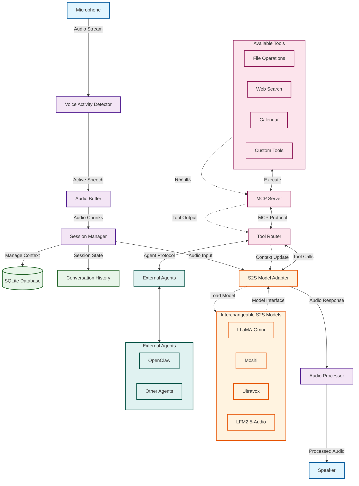

# Voicebot

A voice AI chatbot built in Rust using Speech-to-Speech (S2S) models for natural voice interactions.

## Overview

Voicebot is a mono-user voice assistant that provides AI-powered conversational capabilities with tool integration and external agent support. It leverages modern S2S models for seamless voice-to-voice communication.

## Features

- **Speech-to-Speech Models**: Direct voice-to-voice interaction using state-of-the-art S2S models
- **Tool Integration**: Extensible tool system via Model Context Protocol (MCP)
- **External Agents**: Integration with external agents like OpenClaw
- **Local Data Storage**: SQLite database for persistent user data
- **Mono-user Design**: Optimized for single-user experience

## Architecture

- **Language**: Rust
- **Database**: SQLite
- **AI Models**: S2S (Speech-to-Speech)
- **Protocol**: MCP (Model Context Protocol) for tool integration

### System Architecture Diagram



### Component Responsibilities

| Component | Description |
|-----------|-------------|
| **Microphone** | Captures raw audio input from the user |
| **Voice Activity Detector (VAD)** | Detects when the user is speaking vs. silence |
| **Audio Buffer** | Temporarily stores audio chunks for processing |
| **Session Manager** | Manages conversation state, context, and user sessions |
| **S2S Model Adapter** | Abstraction layer for interchangeable S2S models |
| **S2S Models** | Pluggable speech-to-speech models (LLaMA-Omni, Moshi, etc.) |
| **Tool Router** | Routes tool calls between the S2S model and available tools |
| **MCP Server** | Implements Model Context Protocol for tool integration |
| **Tools** | Various capabilities (file ops, web search, calendar, etc.) |
| **External Agents** | Integration with external AI agents like OpenClaw |
| **Audio Processor** | Post-processes audio response before output |
| **Speaker** | Outputs audio responses to the user |
| **SQLite Database** | Persists conversation history and user data |

### Data Flow

1. **Input Path**: Microphone → VAD → Audio Buffer → Session Manager → S2S Adapter → Model
2. **Tool Execution**: Model → Tool Router → MCP Server → Tools → Results back to Model
3. **Agent Interaction**: Model → Tool Router → External Agents → Results back to Model
4. **Output Path**: Model → S2S Adapter → Audio Processor → Speaker
5. **Persistence**: Session Manager ↔ SQLite Database (continuous state management)

## Available Open Source S2S Models

The following open source Speech-to-Speech models can be run locally:

### Production-Ready Models

- **[LFM2.5-Audio](https://huggingface.co/LiquidAI/LFM2.5-Audio-1.5B)** - LFM2.5-Audio-1.5B is Liquid AI's updated end-to-end audio foundation model. Key improvements include a custom, LFM based audio detokenizer, llama.cpp compatible GGUFs for CPU inference, and better ASR and TTS performance.
- 
- **[LLaMA-Omni](https://github.com/ictnlp/llama-omni)** - Low-latency end-to-end speech interaction model built on Llama-3.1-8B-Instruct, aiming for GPT-4o level capabilities
- **[LLaMA-Omni 2](https://arxiv.org/abs/2505.02625)** - Series of models (0.5B to 14B parameters) with autoregressive streaming speech synthesis, built on Qwen2.5, achieving sub-second response times
- **[Moshi](https://github.com/kyutai-labs/moshi)** - Real-time voice LLM with full-duplex conversation support (can listen and respond simultaneously), uses dual-stream output architecture
- **[Ultravox](https://github.com/fixie-ai/ultravox)** - Whisper + Llama hybrid model for speech-to-speech interaction

### Research & Experimental Models

- **[Hugging Face Speech-to-Speech](https://github.com/huggingface/speech-to-speech)** - Modular, open-source effort for GPT-4o-like capabilities
- **[CleanS2S](https://github.com/opendilab/cleans2s)** - High-quality streaming S2S interactive agent in a single file
- **[MooER-omni](https://github.com/MooreThreads/MooER)** - End-to-end speech interaction models with training and inference code
- **[StreamSpeech](https://github.com/ictnlp/StreamSpeech)** - All-in-one seamless model for offline and simultaneous speech recognition, translation, and synthesis
- **[SpireLM](https://github.com/utter-project/spirelm)** - 7B parameter decoder-only model with speech-centric capabilities

### Key Considerations

- Models like LLaMA-Omni 2 and Moshi offer response times under 300ms
- Audio tokenization via neural codecs (e.g., EnCodec) enables transformer processing
- Trade-offs include higher token costs (~10x) and reduced output control compared to cascade architectures
- Full-duplex models like Moshi provide more natural conversation flow

## Prerequisites

- Rust (latest stable version)
- SQLite 3

## Installation

```bash
# Clone the repository
git clone <repository-url>
cd voicebot

# Build the project
cargo build --release
```

## Usage

```bash
# Run the voicebot
cargo run --release
```

## Configuration

Configuration details will be documented as the project develops.

## Project Structure

```
voicebot/
├── src/           # Source code
├── models/        # AI Models
├── Cargo.toml     # Rust dependencies
└── readme.md      # This file
```

## Development

```bash
# Run in development mode
cargo run

# Run tests
cargo test

# Format code
cargo fmt

# Lint code
cargo clippy
```

## Roadmap

- [ ] Core S2S model integration
- [ ] SQLite database schema and persistence layer
- [ ] MCP tool system implementation
- [ ] OpenClaw agent integration
- [ ] Voice input/output handling
- [ ] Configuration system

## License

Private project - All rights reserved

## Notes

This is a private project for personal use.
